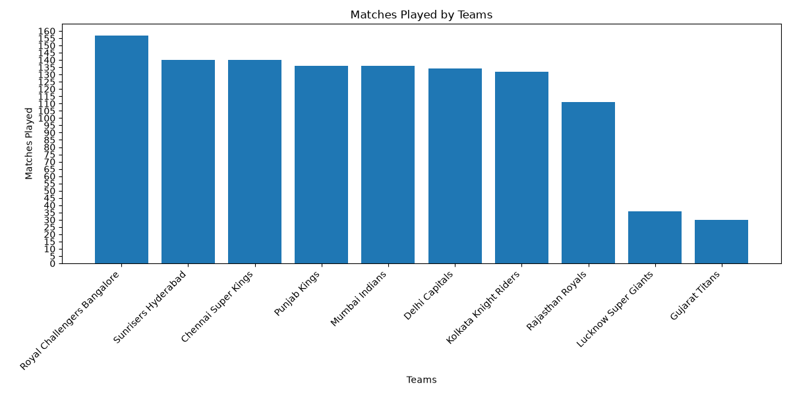
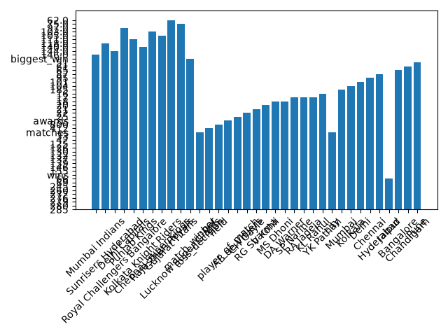

# IPL Cricket Analytics 🏏

## 📊 Project Overview
This project analyzes IPL (Indian Premier League) data using SQL and Python.

## 🔧 Tools Used
- SQLite
- Python (Pandas, Matplotlib)

## 📁 Project Structure
```
ipl-cricket-analytics/
│── data/raw/ipl.db
│── sql/practice/
│   ├── analysis.sql
│   ├── advanced.sql
│   ├── final.sql
│   ├── plot.sql
│── reports/
│   ├── analysis.csv
│   ├── advanced.csv
│   ├── final.csv
│   ├── plot.csv
│   ├── teams_matches.png
│   ├── team_wins.png
│   ├── insights.txt
│── plot.py
│── README.md
```

## 📊 Key Insights
- Mumbai Indians have most wins
- Chennai Super Kings highest win %
- Fielding first wins more matches
- AB de Villiers has most awards

## 📈 Visualizations

### Matches Played by Teams


### Wins by Teams


## ▶️ How to Run

```bash
# Run SQL queries
sqlite3 -header -csv data/raw/ipl.db < sql/practice/analysis.sql > reports/analysis.csv

# Generate graphs
python plot.py
```